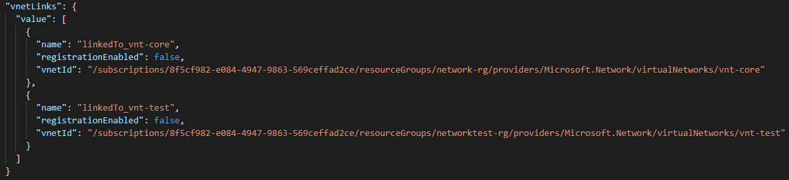
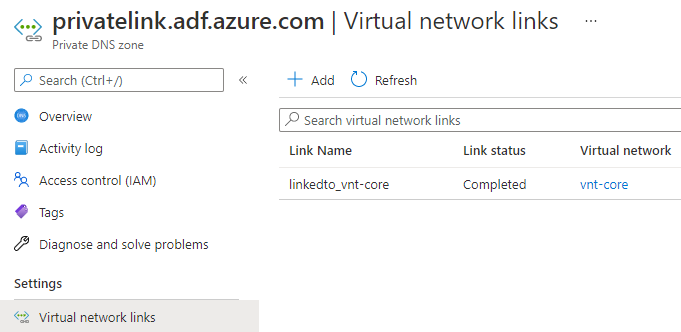
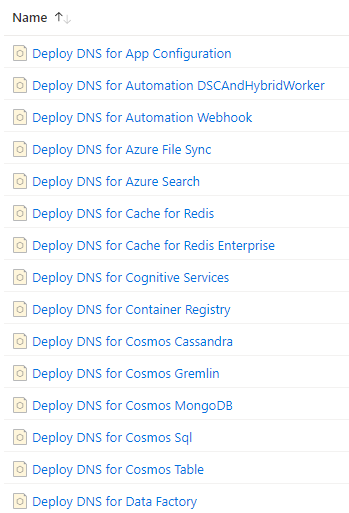
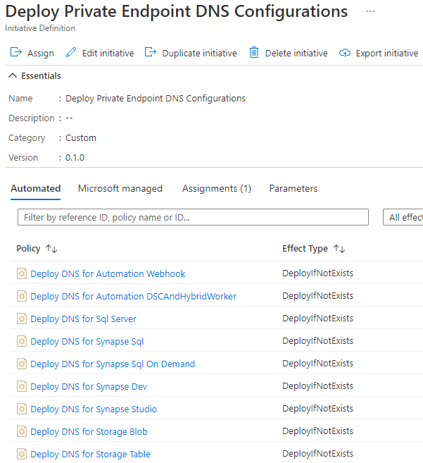

# PrivateEndpoint
This repository is to help you get started with deploying and managing Private Endpoints for your Azure resources. Everything is deployed using Bicep.

## What are Private Endpoints?
Private Endpoints connects your existing PaaS services in Azure to a virtual network, allowing other services inside Azure or on-premises to connect to the Private Endpoint enabled services over your private network. Enabling Private Endpoint on a service does not give it outbound connectivity, it only handles inbound.

## Deploy Private Link DNS Zones
To get started you'll first need to deploy all the private DNS zones for the services you require. Remove the zones you don't need from the `deploy-privatelink-zones\dns.parameters.json` file, or deploy them all at once.

- Deploy zones to resource group, replace **ResourceGroupName** with your own
  - `New-AzResourceGroupDeployment -ResourceGroupName central-dns-rg -TemplateFile .\deploy-privatelink-zones\dns.bicep -TemplateParameterFile .\deploy-privatelink-zones\dns.parameters.json`

### Create links to virtual networks
Once the zones are created you'll need to create virtual network links for each zone to your virtual networks that host services that should be able to resolve the Private Endpoints to their Private IPs. Doing this by hand for each zone can be very time consuming, instead add the required virtual networks in the `deploy-privatelink-zones\dns.parameters.json` file and redeploy every time a new network is in need of the links.

- Give your link a name
- Add the virtual network resource id

  

- Deploy to add virtual network links
  - `New-AzResourceGroupDeployment -ResourceGroupName central-dns-rg -TemplateFile .\deploy-privatelink-zones\dns.bicep -TemplateParameterFile .\deploy-privatelink-zones\dns.parameters.json`
  
   
  
  

## Manage Private Endpoints using Azure Policy
Now that the zones and links are in place we want an automated and reliable way of creating the DNS records for each Private Endpoint that you enable for your different Azure services. Provided here is a complete policy package that takes care of all the services.

| Parameter | Description |
| --- | --- |
| location | Location can be any Azure location |
| privateLinkZonesSubscriptionId | Subscription id that holds your private DNS zones |
| privateLinkZonesResourceGroup | Resource group that holds your private DNS zones |
| policyInitiativeName | Name of the policy initiative that will be deployed |

 

- Deploy policy package, replace **ManagementGroupId** with your own
  - `New-AzManagementGroupDeployment -ManagementGroupId mg-policy -TemplateFile .\policy-package\main.bicep -TemplateParameterFile .\policy-package\main.parameters.json`
- Assign your newly created initiative
  - Requires **Network Contributor** on Private Endpoint resources and **Private DNS Zone Contributor** on resource group containing all your zones (Network Contributor does the job)

 

Deployed policies

 

Deployed initiative containing all policies

